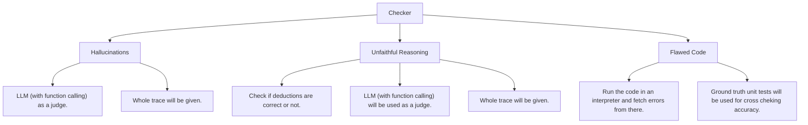

```mermaid
graph TD;
  A["Checker"]
  A1["Hallucinations"]
  A2["Unfaithful Reasoning"]
  A3["Flawed Code"]

  A --> A1
  A --> A2
  A --> A3

  A1a["LLM (with function calling) as a judge."]
  A1b["Whole trace will be given."]
  A1 --> A1a
  A1 --> A1b

  A2a["Check if deductions are correct or not."]
  A2b["LLM (with function calling) will be used as a judge."]
  A2c["Whole trace will be given."]
  A2 --> A2a
  A2 --> A2b
  A2 --> A2c

  A3a["Run the code in an interpreter and fetch errors from there."]
  A3b["Ground truth unit tests will be used for cross cheking accuracy."]
  A3 --> A3a
  A3 --> A3b
```

    
